# Rapport de projet - ElectroFix

## 1. Introduction

ElectroFix est une application web dynamique de gestion des demandes de reparation d'appareils electromenagers. Le projet initialement organise autour d'une application web moderne a ete adapte pour repondre a un cahier universitaire demandant une solution avec un backend PHP, une interface JavaScript, une base de donnees relationnelle, des comptes utilisateurs, une administration, des statistiques et une fonctionnalite d'upload.

L'application permet a un client de creer une demande d'intervention, a un technicien de consulter et traiter les interventions, et a un administrateur de piloter les utilisateurs, les services, les reservations et les statistiques. Dans une evolution theorique du projet, ElectroFix integre egalement un module d'intelligence artificielle capable d'assister le client dans le diagnostic initial d'un appareil, de guider la creation d'un ticket et de recommander des appareils fiables a l'achat selon le besoin de l'utilisateur.

## 2. Objectifs du projet

### 2.1 Objectif general

Mettre en place une plateforme web de reservation et de suivi de services de reparation electromenagere, basee sur un backend PHP connecte a PostgreSQL et une interface frontend Next.js/TypeScript.

### 2.2 Objectifs specifiques

- Permettre l'inscription et la connexion des utilisateurs.
- Permettre au client de consulter et modifier son profil.
- Permettre au client de reserver un service de reparation.
- Permettre aux techniciens de consulter les demandes assignees ou disponibles.
- Permettre l'echange de messages entre client et technicien apres affectation.
- Permettre au client d'obtenir une aide au diagnostic avant la creation d'un ticket.
- Permettre au client d'etre accompagne par l'IA pendant la creation d'une demande.
- Permettre au client de recevoir des recommandations d'appareils a acheter selon son budget, ses usages et les pannes frequentes.
- Permettre aux administrateurs de gerer les utilisateurs, les services, les types de problemes et les tickets.
- Afficher des statistiques d'administration.
- Gerer l'upload d'images pour les categories de services.
- Securiser l'acces aux fonctionnalites par roles.

## 3. Cahier des charges

### 3.1 Presentation du besoin

Les utilisateurs ont besoin d'un service simple pour demander une intervention sur un appareil defectueux. L'entreprise ou l'equipe de maintenance a besoin d'un espace centralise pour recevoir les demandes, les affecter aux techniciens, suivre leur etat et consulter les statistiques d'activite.

### 3.2 Acteurs

| Acteur | Description |
| --- | --- |
| Visiteur | Personne non authentifiee pouvant creer un compte ou se connecter. |
| Client | Utilisateur authentifie qui cree et suit ses demandes de reparation. |
| Technicien | Utilisateur charge de prendre en charge et traiter les tickets. |
| Administrateur | Responsable de la gestion globale de la plateforme. |
| Assistant IA | Module logiciel qui analyse les symptomes, propose une orientation et accompagne le client. |

### 3.3 Fonctionnalites attendues

#### Visiteur

- Creer un compte client.
- Se connecter a l'application.

#### Client

- Consulter son tableau de bord.
- Modifier ses informations personnelles.
- Creer une demande de reparation.
- Consulter la liste de ses tickets.
- Consulter le detail d'un ticket.
- Suivre l'evolution du statut.
- Consulter ses notifications.
- Ouvrir une conversation liee a un ticket assigne.
- Envoyer et recevoir des messages avec le technicien.
- Demander un diagnostic assiste par IA.
- Transformer une suggestion de l'IA en ticket pre-rempli.
- Recevoir des recommandations d'appareils a acheter.

#### Technicien

- Consulter les tickets qui lui sont assignes.
- Consulter les tickets non assignes.
- Prendre en charge un ticket disponible.
- Modifier l'etat d'un ticket selon les transitions autorisees.
- Se desassigner d'un ticket si necessaire.
- Echanger avec le client via conversation.
- Consulter ses notifications.

#### Administrateur

- Consulter les statistiques de la plateforme.
- Gerer les utilisateurs.
- Activer, desactiver, promouvoir ou supprimer un utilisateur.
- Modifier le role d'un utilisateur.
- Consulter et gerer les tickets.
- Assigner un ticket a un technicien.
- Modifier le statut d'un ticket.
- Gerer les categories d'appareils/services.
- Ajouter une image a une categorie de service.
- Gerer les types de problemes par appareil.
- Consulter les statistiques d'utilisation du module IA.
- Gerer la base de connaissances utilisee par l'assistant IA.

### 3.4 Exigences fonctionnelles

| Code | Exigence |
| --- | --- |
| EF01 | Le systeme doit permettre l'inscription d'un nouvel utilisateur. |
| EF02 | Le systeme doit permettre l'authentification par email et mot de passe. |
| EF03 | Le systeme doit generer un jeton JWT apres connexion. |
| EF04 | Le systeme doit appliquer des droits differents selon les roles user, technician et admin. |
| EF05 | Le client doit pouvoir creer une reservation de reparation. |
| EF06 | Une reservation doit contenir un appareil, un probleme, une description, une adresse et des informations de contact. |
| EF07 | Le systeme doit permettre le suivi des statuts pending, assigned, in_progress, completed et cancelled. |
| EF08 | Le systeme doit enregistrer l'historique des changements de statut. |
| EF09 | Le technicien doit pouvoir reclamer un ticket non assigne. |
| EF10 | L'administrateur doit pouvoir gerer les utilisateurs, tickets, appareils et types de problemes. |
| EF11 | L'administrateur doit pouvoir uploader une image pour un service. |
| EF12 | Le systeme doit creer des notifications pour les evenements importants. |
| EF13 | Le client et le technicien doivent pouvoir communiquer via une conversation liee a un ticket. |
| EF14 | L'administrateur doit pouvoir consulter les statistiques globales. |
| EF15 | Le systeme doit permettre au client de decrire des symptomes et d'obtenir une hypothese de diagnostic. |
| EF16 | Le module IA doit proposer un niveau d'urgence, un type de probleme probable et des conseils de securite. |
| EF17 | Le module IA doit pouvoir pre-remplir une demande de reparation a partir du diagnostic. |
| EF18 | Le module IA doit recommander des appareils a acheter selon le type d'appareil, le budget, la marque, l'usage et la fiabilite. |
| EF19 | L'administrateur doit pouvoir consulter l'historique et les statistiques des interactions IA. |

### 3.5 Exigences non fonctionnelles

| Domaine | Exigence |
| --- | --- |
| Securite | Mots de passe haches avec Bcrypt et authentification par JWT HS256. |
| Performance | Index sur les colonnes frequemment consultees: tickets, notifications et conversations. |
| Maintenabilite | Backend PHP structure en classes Api, Database, Jwt, Schema et ApiException. |
| Portabilite | Execution via Docker Compose avec services frontend, backend et PostgreSQL. |
| Ergonomie | Interface separee par espaces: client, technicien et administrateur. |
| Fiabilite | Base de donnees relationnelle avec cles etrangeres et contraintes d'unicite. |
| Transparence IA | Les reponses IA doivent etre presentees comme une aide indicative et non comme un diagnostic definitif. |
| Confidentialite IA | Les donnees envoyees au module IA doivent etre limitees aux informations utiles au diagnostic. |

### 3.6 Contraintes techniques

- Backend: PHP 8.3.
- Frontend: Next.js avec TypeScript.
- Base de donnees: PostgreSQL 15.
- Communication: API REST JSON.
- Authentification: JWT stocke cote client et envoye dans l'en-tete Authorization.
- Deploiement local: Docker Compose.
- Upload: stockage local dans le dossier public/uploads du backend.
- Module IA theorique: service applicatif separe ou composant backend appele par API interne.
- Source de connaissances IA: historique de tickets, types de problemes, fiches de securite et catalogue d'appareils recommandes.

## 4. Architecture generale

L'application suit une architecture client-serveur.

- Le frontend Next.js affiche les pages et appelle l'API REST.
- Le backend PHP recoit les requetes HTTP, controle les droits, valide les donnees et execute les requetes SQL.
- PostgreSQL conserve les utilisateurs, services, tickets, notifications, conversations et historiques.
- Le module IA theorique analyse les symptomes, consulte une base de connaissances et retourne des suggestions structurees au backend.

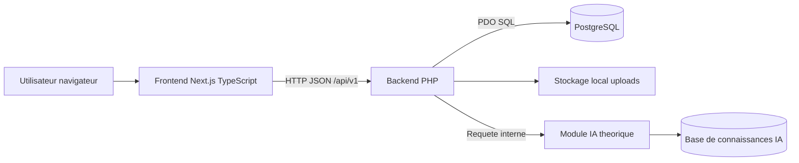

## 5. Modules principaux

| Module | Role |
| --- | --- |
| Authentification | Inscription, connexion, profil, JWT et controle d'acces. |
| Tickets | Creation, consultation, affectation, mise a jour et suppression des demandes. |
| Administration | Gestion utilisateurs, services, types de problemes, tickets et statistiques. |
| Technicien | Consultation des tickets assignes/non assignes, prise en charge et changement de statut. |
| Notifications | Creation, lecture et resume des notifications utilisateur. |
| Conversations | Messagerie entre client et technicien liee a un ticket. |
| Upload | Upload d'image pour les categories d'appareils/services. |
| Assistant IA | Diagnostic indicatif, aide a la creation de ticket et recommandations d'achat. |

## 6. API REST principale

| Methode | Endpoint | Role principal |
| --- | --- | --- |
| POST | /api/v1/auth/register | Visiteur |
| POST | /api/v1/auth/login | Visiteur |
| GET | /api/v1/auth/me | Utilisateur connecte |
| PUT | /api/v1/auth/me | Utilisateur connecte |
| GET | /api/v1/appliances | Utilisateur connecte |
| GET | /api/v1/problem-types | Utilisateur connecte |
| POST | /api/v1/tickets | Client |
| GET | /api/v1/tickets | Client |
| GET | /api/v1/tickets/{id} | Client/Admin/Technicien autorise |
| PATCH | /api/v1/tickets/{id}/status | Utilisateur autorise |
| GET | /api/v1/technician/tickets | Technicien |
| GET | /api/v1/technician/unassigned | Technicien |
| POST | /api/v1/technician/tickets/{id}/claim | Technicien |
| GET | /api/v1/admin/stats | Administrateur |
| GET | /api/v1/admin/users | Administrateur |
| GET | /api/v1/admin/tickets | Administrateur |
| GET/POST | /api/v1/admin/appliances | Administrateur |
| POST | /api/v1/admin/appliances/{id}/upload | Administrateur |
| GET/POST | /api/v1/admin/problem-types | Administrateur |
| GET/POST | /api/v1/conversations | Client/Technicien |
| POST | /api/v1/conversations/{id}/messages | Client/Technicien |
| GET | /api/v1/notifications | Utilisateur connecte |
| POST | /api/v1/ai/diagnostics | Client |
| GET | /api/v1/ai/diagnostics/{id} | Client/Admin |
| POST | /api/v1/ai/diagnostics/{id}/ticket-draft | Client |
| POST | /api/v1/ai/recommendations | Client |
| GET | /api/v1/admin/ai/stats | Administrateur |
| GET/POST | /api/v1/admin/ai/knowledge | Administrateur |

## 7. Conception UML

### 7.1 Diagramme de cas d'utilisation

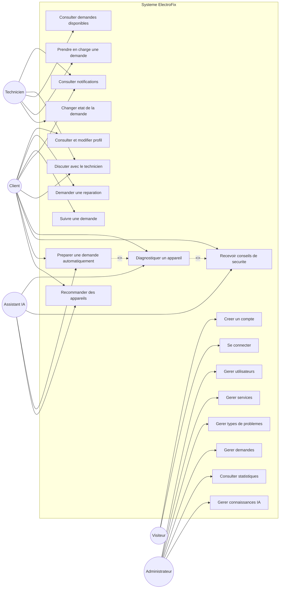

### 7.2 Diagramme de classes metier

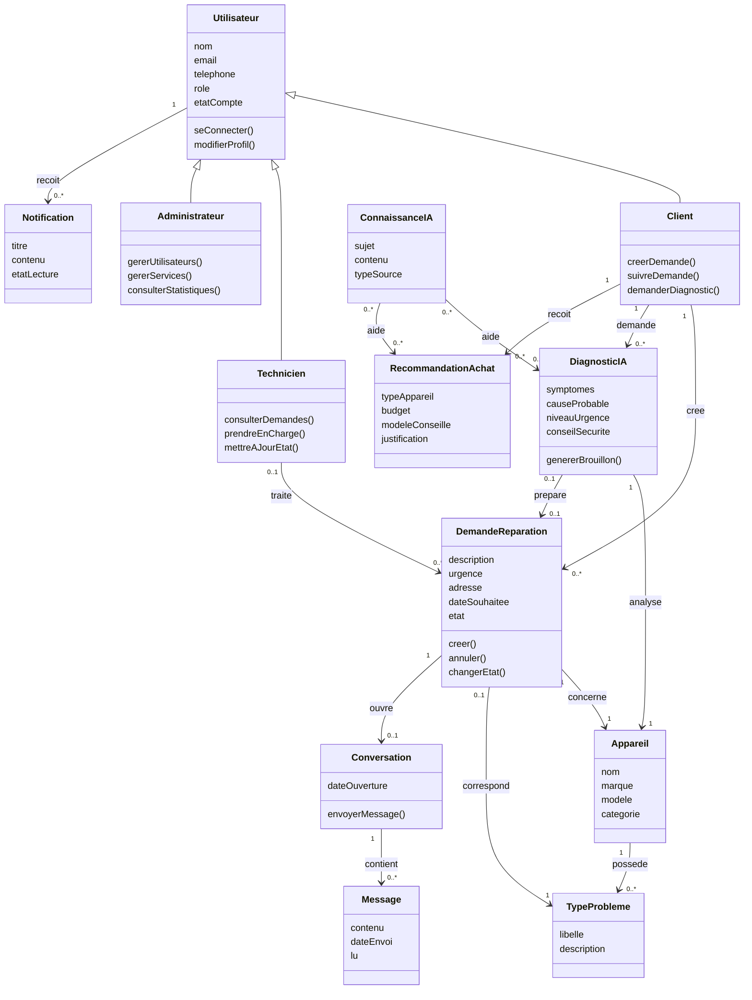

### 7.3 Diagramme de classes d'analyse - Module IA

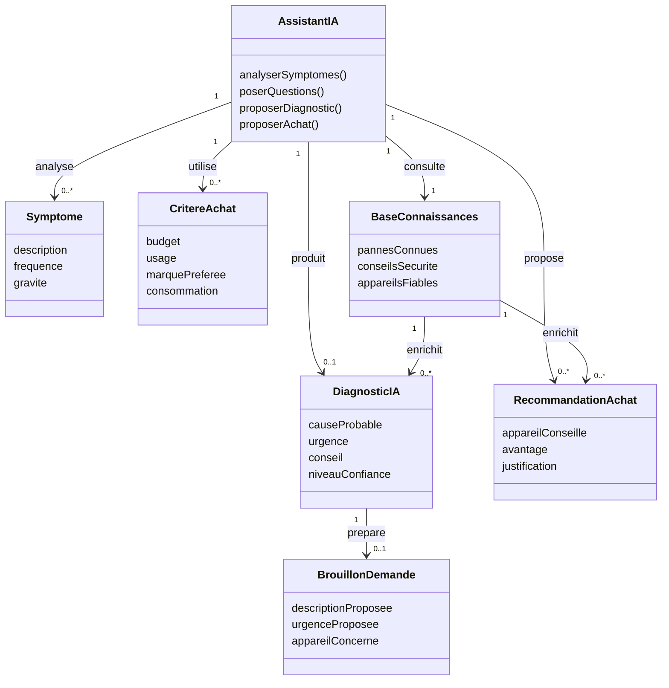

### 7.4 Diagramme de sequence - Connexion

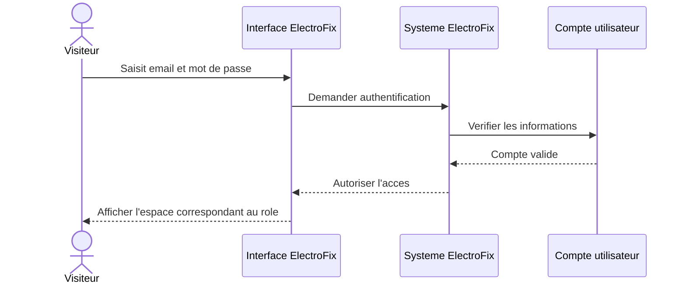

### 7.5 Diagramme de sequence - Creation d'une reservation

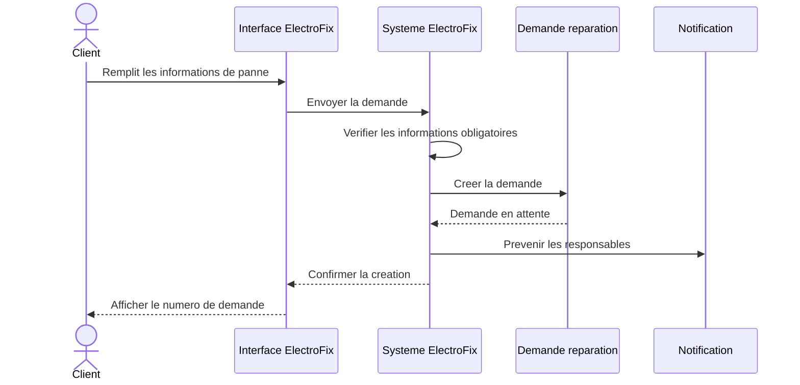

### 7.6 Diagramme de sequence - Prise en charge par un technicien

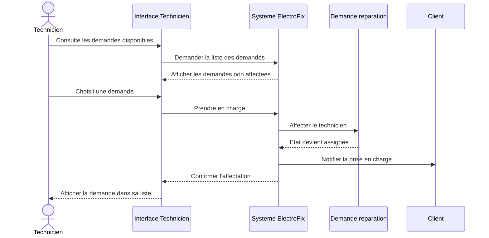

### 7.7 Diagramme de sequence - Conversation client/technicien

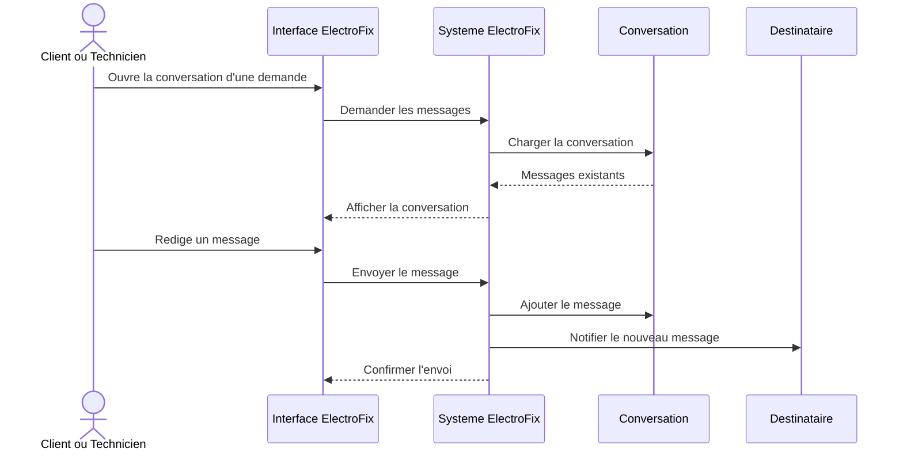

### 7.8 Diagramme de sequence - Diagnostic assiste par IA

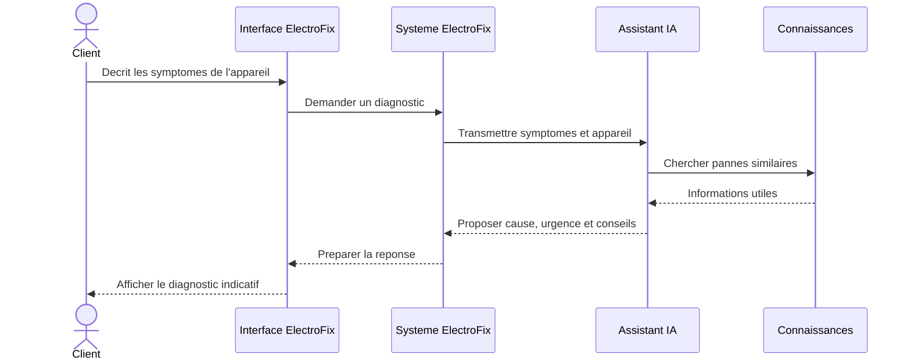

### 7.9 Diagramme de sequence - Creation d'un ticket depuis l'IA

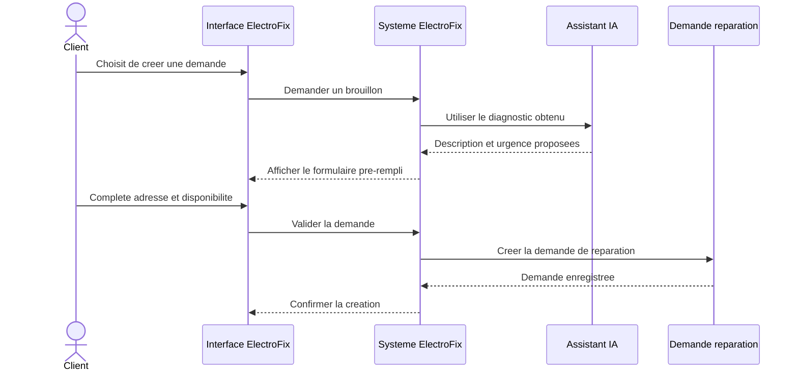

### 7.10 Diagramme de sequence - Recommandation d'appareils

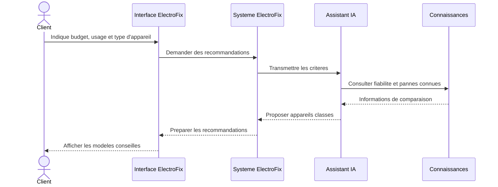

### 7.11 Diagramme d'activite - Diagnostic IA et creation de ticket

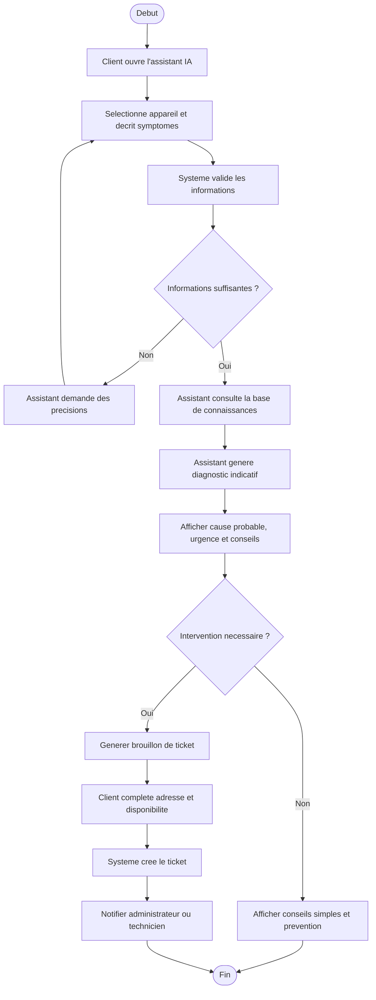

### 7.12 Cycle de vie d'un ticket

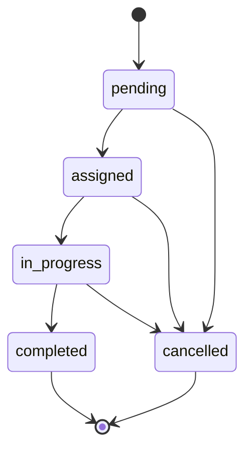

## 8. Modele relationnel

| Table | Description |
| --- | --- |
| users | Comptes utilisateurs avec roles et informations de profil. |
| appliances | Categories d'appareils ou services de reparation. |
| problem_types | Types de problemes associes a un appareil. |
| tickets | Reservations/demandes de reparation. |
| ticket_status_history | Historique des changements d'etat d'un ticket. |
| ticket_media | Medias associes a un ticket. |
| notifications | Notifications utilisateur. |
| conversations | Conversation unique liee a un ticket assigne. |
| conversation_messages | Messages d'une conversation. |
| refresh_tokens | Table prevue pour jetons de rafraichissement. |
| password_reset_tokens | Table prevue pour reinitialisation de mot de passe. |
| ai_diagnostic_sessions | Sessions de diagnostic IA associees a un client et a un appareil. |
| ai_diagnostic_messages | Messages echanges entre le client et l'assistant IA pendant le diagnostic. |
| ai_ticket_drafts | Brouillons de tickets generes a partir d'un diagnostic IA. |
| ai_recommendations | Recommandations d'appareils proposees au client. |
| ai_knowledge_base | Donnees de reference utilisees par le module IA. |

## 9. Securite

- Les mots de passe sont stockes sous forme de hash Bcrypt via password_hash.
- Les requetes protegees exigent un jeton JWT valide.
- Le JWT contient au minimum l'identifiant utilisateur, le role et la date d'expiration.
- Les roles sont verifies dans le backend avant les actions sensibles.
- Les requetes SQL utilisent PDO avec requetes preparees.
- Les comptes desactives ne peuvent pas se connecter.
- Les conversations sont accessibles uniquement au client ou au technicien concerne.
- Les diagnostics IA restent accessibles uniquement au client concerne et aux administrateurs.
- Les reponses IA doivent afficher un avertissement indiquant que le diagnostic est indicatif.
- Les donnees sensibles non necessaires ne doivent pas etre envoyees au moteur IA.
- Les recommandations d'achat doivent etre justifiees par des criteres objectifs: budget, usage, fiabilite, disponibilite et historique des pannes.

## 10. Transformation vers backend PHP

Le projet a ete adapte pour satisfaire une contrainte universitaire PHP + JavaScript. La logique serveur active se trouve dans:

- backend/public/index.php: point d'entree HTTP.
- backend/src/bootstrap.php: chargement de la configuration et connexion base de donnees.
- backend/src/Database.php: creation de la connexion PDO PostgreSQL.
- backend/src/Schema.php: creation automatique des tables, index et donnees initiales.
- backend/src/Jwt.php: encodage et decodage des jetons JWT.
- backend/src/Api.php: routage REST, validation, controle d'acces et traitements metier.
- backend/src/ApiException.php: gestion des erreurs HTTP applicatives.

L'ancien backend non PHP a ete remplace par un backend PHP autonome, tandis que le frontend Next.js continue de consommer l'API via des appels HTTP JSON.

## 11. Tests et validation fonctionnelle

Les scenarios suivants permettent de valider le projet:

| Scenario | Resultat attendu |
| --- | --- |
| Inscription client | Un compte user est cree en base. |
| Connexion admin | Un JWT est retourne et l'interface admin est accessible. |
| Creation ticket client | Un ticket pending est cree avec historique. |
| Consultation tickets client | Le client voit uniquement ses demandes. |
| Prise en charge technicien | Le ticket passe a assigned avec technicien associe. |
| Changement statut | Les transitions respectent le cycle autorise. |
| Conversation | Client et technicien peuvent echanger des messages. |
| Notifications | Les notifications non lues sont comptees et peuvent etre marquees comme lues. |
| Upload image service | L'image est stockee et l'URL est associee a l'appareil. |
| Statistiques admin | Les compteurs et repartitions sont affiches. |
| Diagnostic IA | Le client obtient une cause probable, une urgence et des conseils de securite. |
| Ticket depuis IA | Un brouillon de ticket est cree a partir d'un diagnostic puis transforme en demande. |
| Recommandation IA | Le client recoit une liste d'appareils recommandes avec justification. |
| Administration IA | L'administrateur consulte les statistiques et gere la base de connaissances IA. |

## 12. Conclusion

ElectroFix repond aux exigences principales d'un projet universitaire PHP + JavaScript: authentification, gestion de comptes, reservation de service, administration, upload, statistiques et base de donnees relationnelle. La conception separe clairement les roles client, technicien et administrateur. Le backend PHP centralise la logique metier et la securite, tandis que le frontend Next.js fournit une interface moderne et exploitable.

L'ajout theorique du module IA renforce la valeur fonctionnelle de la plateforme. Il permettrait au client de mieux comprendre une panne avant l'intervention, de creer plus rapidement une demande grace a un ticket pre-rempli et de recevoir des conseils d'achat adaptes. Ce module resterait encadre par des regles de securite, de confidentialite et de transparence afin de rappeler que l'IA assiste la decision sans remplacer l'expertise d'un technicien.

Les ameliorations possibles sont l'ajout de tests automatises, l'integration d'un envoi email reel pour les notifications, la gestion complete des fichiers media de tickets, la mise en place d'un deploiement distant et l'implementation effective du module IA de diagnostic et de recommandation.
